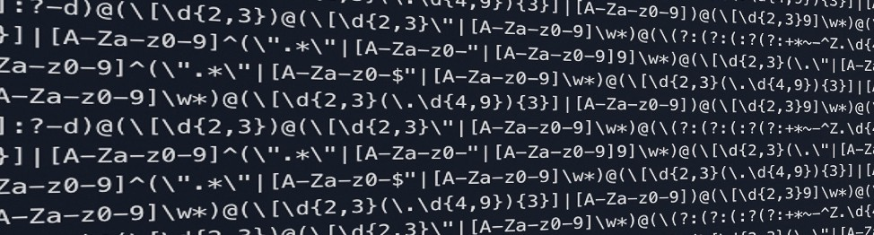

# Regex introduction
In this repository you'll find a jupyter notebook with a guided introduction to regex.

The jupyter notebook goes through:
- Basic regex syntax
    - what, where & how many
- Regex and python
    - Finding the pattern
    - Working with it
- Regex & dataframes
- Hands on example

External resources
- [regex 101](https://regex101.com)
- [regex one](https://regexone.com/lesson/capturing_groups)
